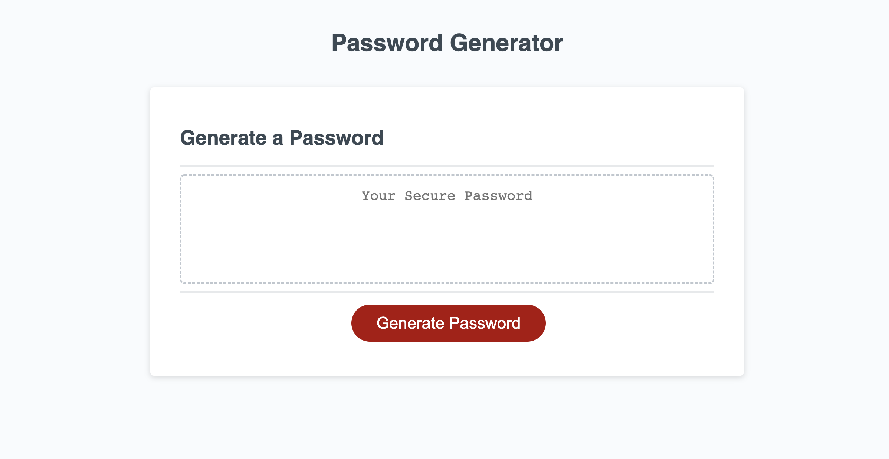

# javascript-password-generator
A simple password generator written in javascript.

Prompts the user to input total password length and asks for character type restrictions such as: uppercase letters, lowercase letters, numbers and special characters.

Attempts to use an equal number of each character type that the user specifies.

## Sample Image of Page

### Website Link:
https://cblake506.github.io/javascript-password-generator/